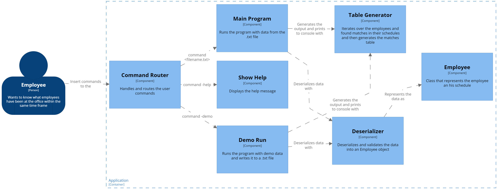

## Quickstart

> **`NodeJS v18.2.0`** or higher is required

Install dependencies with `npm`

```
npm install
```

## Usage

Build to `Javascript`:

```
npm run build
```

Run unit tests:

```
npm run test
```

Run with `npm`:

```
npm run start -- <filepath | options>

options: -help: Prints this help message
         -demo: Creates a demo file (demo.txt) and executes over it
```

Run with `NodeJS` (after the build process):

```
node build/index.js <filepath | options>

options: -help: Prints this help message
         -demo: Creates a demo file (demo.txt) and executes over it
```

### Data format

Make sure that the input .txt file complies with the format:

```
$(NAME)=$(MO|TU|WE|TH|FR|SA|SU)$(HH:MM)-$(HH:MM),$(MO|TU|WE|TH|FR|SA|SU)$(HH:MM)-$(HH:MM),...
$(NAME)=$(MO|TU|WE|TH|FR|SA|SU)$(HH:MM)-$(HH:MM),$(MO|TU|WE|TH|FR|SA|SU)$(HH:MM)-$(HH:MM),...
...
```

## Problem description

The company ACME offers their employees the flexibility to work the hours they want. But due to some external circumstances they need to know what employees have been at the office within the same time frame

The goal of this exercise is to output a table containing pairs of employees and how often they have coincided in the office.
Input: the name of an employee and the schedule they worked, indicating the time and hours. This should be a .txt file with at least five sets of data. You can include the data from our examples below:

### Example 1:

#### INPUT:

```csv
RENE=MO10:00-12:00,TU10:00-12:00,TH01:00-03:00,SA14:00-18:00,SU20:00-21:00
ASTRID=MO10:00-12:00,TH12:00-14:00,SU20:00-21:00
ANDRES=MO10:00-12:00,TH12:00-14:00,SU20:00-21:00
```

#### OUTPUT:

```
ASTRID-RENE: 2
ASTRID-ANDRES: 3
RENE-ANDRES: 2
```

### Example 2:

#### INPUT:

```csv
RENE=MO10:15-12:00,TU10:00-12:00,TH13:00-13:15,SA14:00-18:00,SU20:00-21:00
ASTRID=MO10:00-12:00,TH12:00-14:00,SU20:00-21:00
```

#### OUTPUT:

```
RENE-ASTRID: 3
```

## Solution

The code is composed of several modules and classes to represent the data, the data read from the .txt file is deserialized into objects for manipulation. A CLI was created where the help command, example data and the exercise itself are shown, to validate if the .txt file complies with the established format regular expressions (RegEx) were used.

First I started implementing the deserialization module, to later do the data and format validation. I created the classes that represent each entry of the .txt file with methods that would help me to make the comparisons later.

Once I had the data to work with, I made the iterations between all the members, in another module I generated the table with an array of objects that represent the schedule matches.

Finally I implemented the CLI, refactored the code and wrote the unit tests to check the result of my components.

## Solution Architecture

Using [C4 Model](https://c4model.com/) I created the components diagram.


